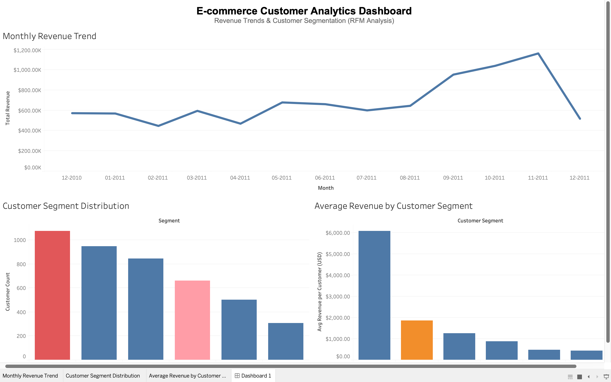

# E-commerce Customer Analytics Dashboard (RFM Analysis)

## 📌 Overview
This project analyzes customer behavior and revenue trends using an e-commerce dataset.

It applies RFM (Recency, Frequency, Monetary) segmentation to identify high-value customers, churn risks, and growth opportunities.

---

## 🛠 Tech Stack
- Python (Pandas, NumPy)
- SQL
- Tableau
- Data Visualization

---

## 📊 Key Analysis

### 1. Revenue Trend Analysis
- Analyzed monthly revenue patterns
- Identified strong seasonality with peak performance in Q4

### 2. Customer Segmentation (RFM)
Customers were segmented into:
- VIP
- Loyal
- At Risk
- Churn Risk
- Regular
- Potential Loyalist

### 3. Business Insights
- Large proportion of customers fall into churn-risk category → retention opportunity
- Loyal customers show strong potential to be converted into VIP
- VIP customers contribute significantly higher revenue

---

## 📈 Dashboard

---

## 💡 Key Insights
- Revenue peaks in Q4, indicating seasonal demand
- Churn-risk customers require targeted retention strategies
- Loyal customers are the best candidates for conversion campaigns

---

## 📂 Project Structure
ecommerce-customer-analytics/
│
├── data
├── notebooks
├── outputs
├── dashboard
└── README.md

